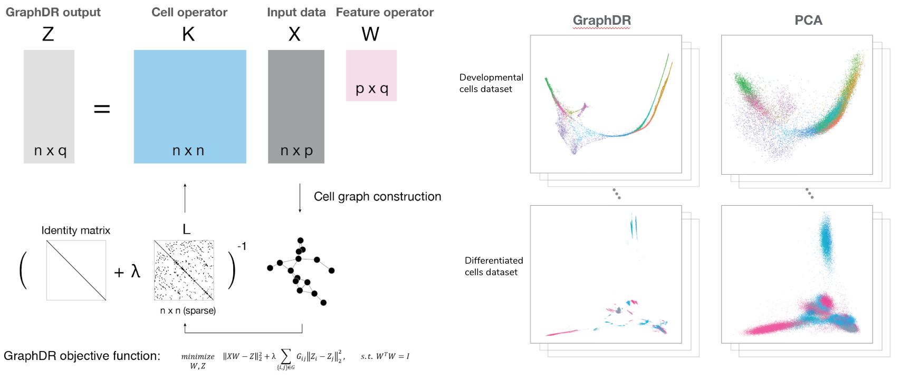

Welcome to Quasildr's documentation!
====================================

Quasildr is a python library for quasilinear data representation.
It mainly implements two methods, a fast quasilinear data visualization
method GraphDR and a structure extraction and inference method StructDR based on Nonparametric Ridge
Estimation.

GraphDR - visualization and general-purpose representation:

StructDR - flexible structure extraction and inference of confidence sets:

.. image:: _static/StructDR.png
  :width: 400
  :alt: Schematic overview of StructDR

The package is developed for single-cell omics data analysis applications,
but the method is general enough for visualization and structure extraction of
high dimensional data, so I expect it to be useful on many other data types as well.

.. toctree::
   :maxdepth: 1
   :caption: Introduction

   Installation
   Tutorials

.. toctree::
   :maxdepth: 1
   :caption: Python API

   graphdr
   structdr
   utils

